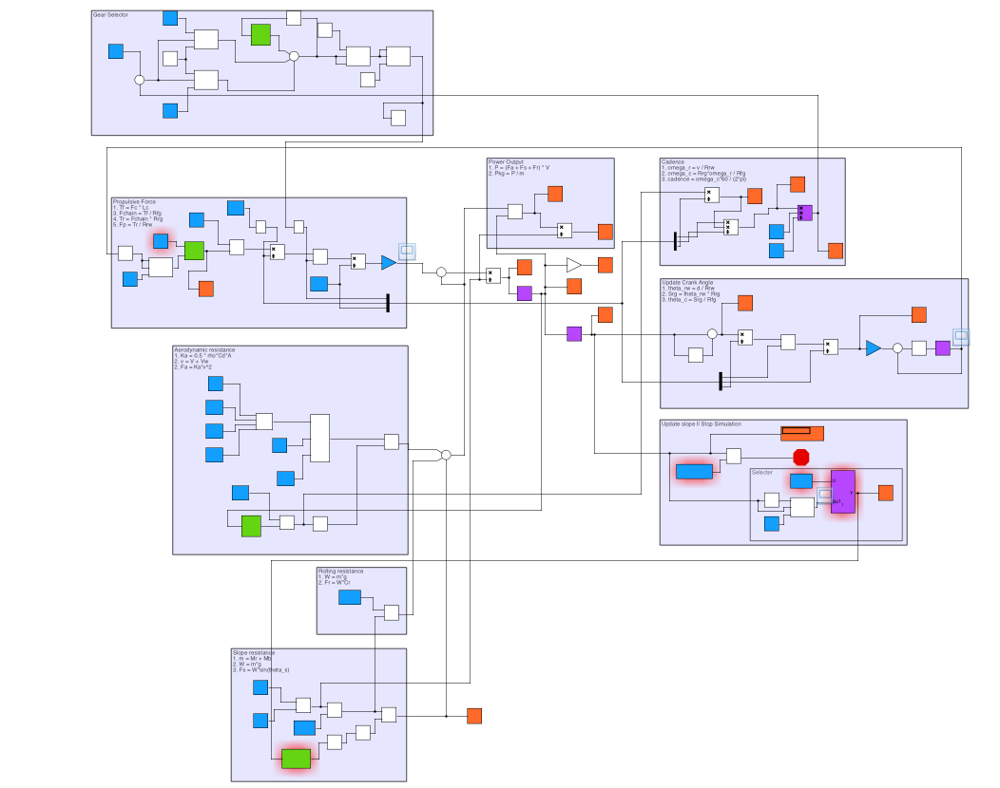

# simulink-cycling-course

 A model for predicting the finishing time of cyclists on specific courses

| Author(s) | Brief Description | Intended Uses and Known Limitations | Included Material | Updated |
|-|-|-|-|-|
| Ross Wilkinson, Ph.D. | A Simulink model that predicts the finishing time of a cyclist based on their propulsive force production and the elevation profile of the terrain. | Provides numerous comparisons of rider and environmental variables that can affect the ground velocity of the rider. Haven't figured out why the fuzzy-logic controller won't select a gear ratio that would maintain a preset optimal cadence. |  Simulink Model | April 19, 2021 |
